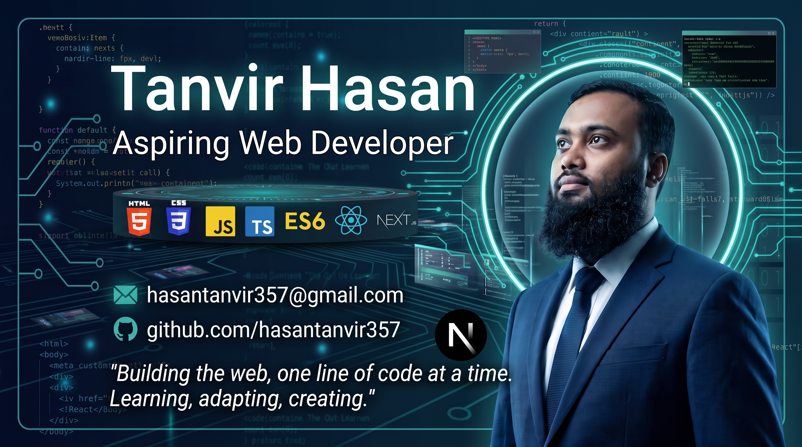

  

    

  <h1>Hi there, I'm Tanvir Hasan 👋</h1>
  <h3>Frontend Developer | React & Next.js Enthusiast</h3>
  
Building pixel-perfect, engaging, and accessible digital experiences.

  

    
    
    
  

 

### 💫 About Me
* 🔭 I’m currently building modern web applications with **React.js** and **Next.js**.
* 🌱 I’m constantly learning and exploring new technologies, currently focusing on **Advanced Next.js** and **Web Architecture**.
* 💡 I love writing clean, reusable code and creating highly responsive user interfaces.
* 💬 Ask me about **HTML, CSS, Tailwind CSS, JavaScript (ES6+), React, and UI/UX implementation**.
* 📫 How to reach me: **[hasantanvir357@gmail.com](mailto:hasantanvir357@gmail.com)**

---

### 💻 Tech Stack

**Languages & Core:**

  
  
  
  

**Frameworks & Libraries:**

  
  
  

---

### 📈 GitHub Activity & Stats

<!-- Dynamic Activity Graph -->

  

 

  
  

  

---

### 💡 Daily Dev Quote

  
  
    
  
  

